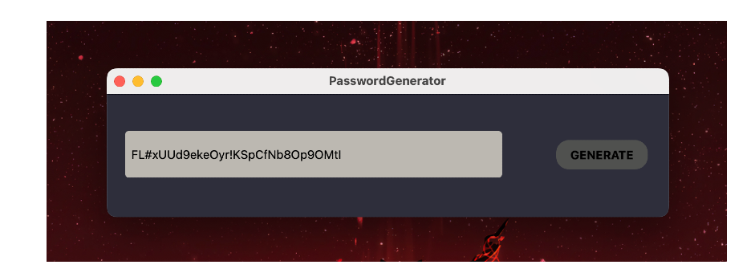

# Secure Password Generator

A **Secure Password Generator** built with **Qt** and **C++**. This application allows users to generate random and secure passwords using a mix of letters, numbers, and special characters.

## Features

- Randomly generates secure passwords.
- Uses a combination of:
  - Lowercase letters
  - Uppercase letters
  - Numbers
  - Special characters
- Simple and intuitive user interface created with Qt.
- Copy the generated password for immediate use.

## SCREENSHOT

